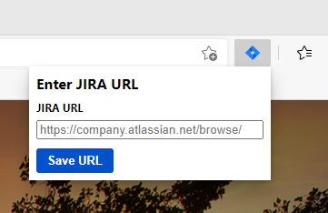
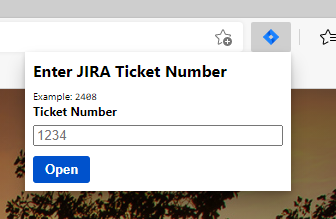

# Simple Edge extension

This is a simple edge extension to open a new tab to a Jira ticket.

### Installation

1. Click on the 3 dots to open the menu in Edge
2. Click on `Extensions`
3. Enable `Developer Mode` at the bottom left.
4. Click the `Load unpacked` button, and upload this repo.

### Screenshots

#### Add your company JIRA URL

#### Enter in the ticket number

